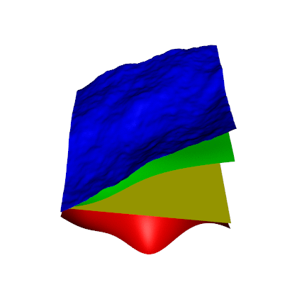

<!-- README.md is generated from README.Rmd. Please edit that file -->

# lithosphere

<!-- badges: start -->

<!-- badges: end -->

The goal of lithosphere is to provide a fast and easy way to build
3D-geological models.

## Installation

`lithosphere` is not (yet) on CRAN but you can install the development
version from [GitHub](https://github.com/) with:

``` r
# install.packages("remotes")
remotes::install_github("Ignimbrit/lithosphere")
```

## Introduction

3D-geological modeling is the art of creating a continuous
representation (a model) of the structure of the underground based on
(often severely) limited information. To do so, you gather your data
points about where certain types of rock start and end, often collected
from expensive and therefore rare drilling operations and interpolate
between those.

3D-geological modeling is usually carried out using specialized software
to combine powerful interpolation algorithms with all kinds of parsers
for hard and soft (the geologists educated guesswork) input. Such
software can become extremely sophisticated, difficult to learn/master
and fairly expensive. `lithosphere` is none of these things.

`lithosphere` was designed to make 3D-geological modeling as easy and
fast as possible by providing a minimal interface with access to
classical geostatistical interpolation algorithms, namely kriging, and
keeping all the tedious details of layer management away from the user.
The main usecase for `lithosphere` is expected to lay with preprocessing
of geology data for (not too complex) groundwater flow models such as
modflow, that benefit greatly from a more precise representation of the
underground.

## Example

`lithosphere` comes with a simple synthetic test dataset for
demonstration purposes. We can use it to build and assess a full scale
3D-geological model.

``` r
library(lithosphere)

data("synthetic_welldata_1")
data("synthetic_dem_1")
```

The only input data strictly required to build a `lithosphere` model is
a sufficiently large set of xyz-label (= geology) data points.
Additionally, however, the model benefits greatly from specifying the
position of the ground level with a digital elevation model (“dem”).

The first step in building a model is by defining a grid and a
stratigraphic sequence. Note that this sequence must be presented to the
`lithosphere`-model in sorted order: uppermost (youngest) to lowermost
(oldest).

``` r
# initialize a new model
mymodel <- Lithosphere$new(
 xmin = 0, xmax = 1000, xres = 10, 
 ymin = 0, ymax = 1000, yres = 10, 
 stratigraphy = c("upper_sand", "intermediate_clay", "lower_marl")
)

# adding all necessary input information
mymodel$set_DEM(synthetic_dem_1)
mymodel$set_markers(xyzg = synthetic_welldata_1[, c("x", "y", "z", "stratigraphy")])
```

That’s it. That was the model setup. Note that `lithosphere` is based on
the [R6-class](https://r6.r-lib.org/articles/Introduction.html) system
for object oriented programming. The syntax may look unfamiliar too some
R-users but we will not need too much of it.

Now that the model is completely constrained the last thing to do is to
start the interpolation.

``` r

mymodel$interpolate_surfaces(engine = "uk", erosion = "topdown")
```

Note that the `interpolate_surfaces` function comes with two arguments:
engine and erosion. Engine refers to the interpolation algorithm
employed to generate the continuous surfaces. Currently implemented are
Universal Kriging (“uk”), Ordinary Kriging (“ok”), and Inverse Distance
Weighted (“idw”) interpolation. Under the hood, `lithosphere` runs a
combination of
[gstat](https://cran.r-project.org/web/packages/gstat/index.html) and
[automap](https://cran.r-project.org/web/packages/automap/) routines to
keep everything that can break (so, literally everything) away from the
user. Of course this comes at the cost of no possible customization at
all (at least for now).

The second argument is called “erosion” and possible values are
“topdown”, “bottomup” and “none”. This part of the function decides
what should happen, when two interpolated surfaces intersect, which is
fairly common. If, for example, an interpolated surface A is intersected
by the next lower/older lithology-surface B and the option “topdown” is
selected, whenever the raster z-value of the older stratigraphy at
position xy is above the younger surface, the z-value of the older
surface is set to that of the younger surface. This is how many
groundwater flow models prefer their input, as they often have no (easy
to use) concept of NA values. The ground surface as defined by
`$set_DEM` will never erode and in return always erode all other
intersecting surfaces, unless erosion = “none” is selected, in which
case no erosion is applied whatsoever.

With the interpolation complete the resulting surfaces can be exported
as `data.frame` for further processing (or saving).

``` r

mymodel$export_to_data_frame()
```

For easy inspection of results, lithosphere also comes with basic
plotting capabilities. If you are looking for more sophisticated
3D-visualizations, check out the
[rgl-package](https://dmurdoch.github.io/rgl/)\!

``` r

mymodel$plot3d(
  surface_colors = c("blue", "green", "yellow", "red"),
  exag_fct = 3
  )
```



## Some final comments

`lithosphere`is currently in a very early stage in its developement and
basically everything about the interface may change in the very near
future.

## Alternative solutions for 3D-geological modelling

If you are looking for a (much) more sophisticated approach check out
[Gempy](https://github.com/cgre-aachen/gempy)\!

An approach similar to that of `lithosphere` yet probably more mature
can be found with [iMod](https://www.deltares.nl/en/software/imod/)
